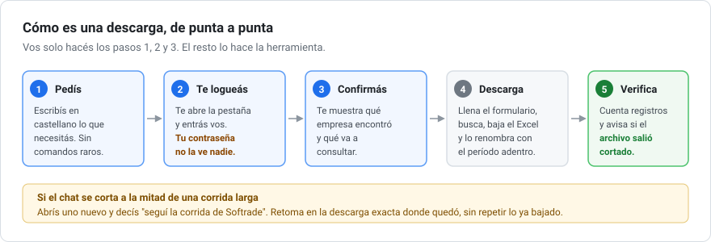
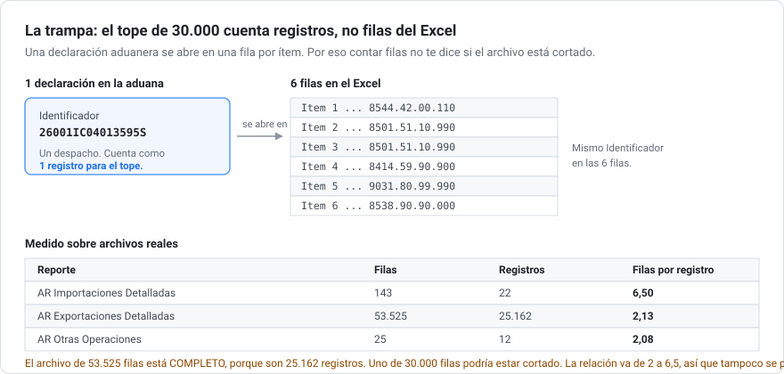

# softrade-batch

**Bajá datos de comercio exterior de [Softrade](https://app.softrade.info) pidiéndolos en castellano, sin pelear con el formulario.**

Vos escribís esto:

> necesito las impo de mi empresa, MI EMPRESA S.A., de este año

Y se encarga de todo: busca la empresa como está escrita en la aduana, te muestra los candidatos para que elijas, arma la consulta, la descarga en Excel, y te avisa si el archivo salió incompleto.

Hecho para el caso que más duele: **cuando son muchas descargas** y a mitad de camino ya no te acordás cuáles bajaste y cuáles no.



---

## Índice

- [Para quién es esto](#para-quién-es-esto)
- [Qué problema resuelve](#qué-problema-resuelve)
- [Qué necesitás antes de empezar](#qué-necesitás-antes-de-empezar)
- [Instalación](#instalación)
- [Tutorial: tu primera descarga](#tutorial-tu-primera-descarga)
- [Ejemplos de pedidos](#ejemplos-de-pedidos)
- [Qué países y qué reportes hay](#qué-países-y-qué-reportes-hay)
- [Las trampas de Softrade](#las-trampas-de-softrade)
- [Preguntas frecuentes](#preguntas-frecuentes)
- [Licencia](#licencia)

---

## Para quién es esto

Si trabajás en comercio exterior, usás Softrade, y te manejás con Excel: **esto es para vos.** No hace falta saber programar ni saber nada de inteligencia artificial.

Si nunca usaste Softrade, esto no te va a servir, porque necesitás una cuenta de ellos.

---

## Qué problema resuelve

Bajar **un** reporte de Softrade es fácil. El tema empieza cuando necesitás varios.

Supongamos que querés las importaciones de tres países, de tres años. Son nueve consultas, y cada una lleva: entrar al país, elegir el reporte, poner el período, poner los filtros, buscar, bajar el Excel, y renombrar el archivo para saber cuál es cuál.

Si en el medio se corta, **no hay forma de saber por dónde ibas**. Los archivos que baja Softrade se llaman todos parecido y no dicen el período adentro del nombre.

Esto lleva una **planilla de control en tu disco** (un archivo `manifest.json`) con una fila por descarga y su estado. Si se corta, abrís de nuevo, decís "seguí la corrida", y retoma exactamente donde quedó.

### Y algo más importante todavía

Softrade **corta las consultas grandes en 30.000 registros** y te lo avisa con un cartel en pantalla que dice:

> Consulta demasiado extensa. Sólo se toman en cuenta los primeros 30.000 registros.

**Ese aviso no queda en el Excel.** Si no lo viste, el archivo se ve perfectamente normal y vos trabajás meses con datos incompletos sin enterarte.

Y no alcanza con mirar cuántas filas tiene, porque **el tope cuenta declaraciones aduaneras, no filas**:



Esta herramienta cuenta los registros sola después de cada descarga y te avisa. Ese solo chequeo ya justifica usarla.

---

## Qué necesitás antes de empezar

Cuatro cosas. Dos son gratis.

| Qué | Para qué | Costo |
|---|---|---|
| **Claude Code** | El programa que ejecuta todo esto | Suscripción de Claude |
| **La extensión Claude para Chrome** | Para que pueda manejar tu navegador | Gratis |
| **Python 3** | Para los chequeos de los archivos | Gratis |
| **Tu cuenta de Softrade** | Los datos | Tu suscripción |

### La extensión de Chrome es obligatoria

Softrade guarda la sesión **por pestaña**. No alcanza con que estés logueado en otra ventana: hay que estar logueado **en la pestaña que la herramienta abre**. Por eso necesita manejar tu Chrome de verdad, no un navegador aparte.

**Tu contraseña nunca la escribe la herramienta.** Te abre la pestaña, te pide que entres vos, y espera a que le digas que ya está. Es así siempre, no es opcional.

### Instalar Python

Si no lo tenés, bajalo de [python.org](https://www.python.org/downloads/). Después, en una terminal:

```bash
pip install pandas openpyxl
```

Eso es todo. Son las dos librerías que leen los Excel.

---

## Instalación

### Opción A: como plugin (recomendada)

Dentro de Claude Code, escribí:

```
/plugin marketplace add mauroemartinez/softrade-batch
```

Y después:

```
/plugin install softrade-batch@sls-global
```

**Con el link del repo alcanza.** No hace falta descargar ni configurar nada a mano.

### Opción B: copiando la carpeta

Bajate el repo y copiá la carpeta `skills/softrade-batch` dentro de tu carpeta de skills.

En Windows es:

```
C:\Users\TU_USUARIO\.claude\skills\softrade-batch
```

En Mac o Linux:

```
~/.claude/skills/softrade-batch
```

La próxima vez que abras Claude Code ya está disponible.

---

## Tutorial: tu primera descarga

### Paso 1: pedile lo que querés, en castellano

Abrí Claude Code y escribí, tal cual:

```
necesito las importaciones de mi empresa MI EMPRESA S.A. de este año
```

No hay ningún comando raro que memorizar. Se activa sola cuando reconoce que estás pidiendo datos de Softrade.

### Paso 2: logueate cuando te lo pida

Te abre una pestaña en Softrade y te dice algo así:

> Abrí una pestaña en Softrade y me tiró al login. Logueate vos ahí y decime "listo".

Entrás con tu usuario y contraseña **vos, a mano**, y escribís "listo".

### Paso 3: confirmá la empresa

Acá está lo importante. Los nombres en la aduana no son los que usás vos. Te muestra lo que encontró:

```
Buscando "MI EMPRESA" aparecen dos:
  1. Mi Empresa Internacional Ltda
  2. Mi Empresa Argentina Sociedad Anonima
¿Cuál es?
```

**Elegir mal no da error.** Te devuelve otro set de datos igual de creíble. Por eso siempre pregunta antes.

### Paso 4: confirmá la consulta

Te muestra la línea completa antes de tocar nada:

> Importaciones detalladas, Argentina, importador MI EMPRESA ARGENTINA S.A., de 01/2026 a 07/2026. Un solo tramo. ¿Confirmás?

Fijate que dice **hasta 07/2026** aunque pediste "este año". Es porque Softrade tiene los datos cargados hasta ahí, y lo lee del propio calendario del sitio en vez de suponerlo.

### Paso 5: revisá lo que salió

Baja el Excel, lo renombra con algo que se entienda, y te dice qué trajo:

```
ar_importDetalladas_2026-01_2026-07.xlsx
143 filas, 22 registros, 36 columnas
```

Si el archivo hubiera salido cortado, te lo dice ahí mismo y **no lo marca como listo**.

---

## Ejemplos de pedidos

Todos estos funcionan escritos así, en castellano normal:

| Lo que escribís | Lo que hace |
|---|---|
| `las impo de MI EMPRESA S.A. de este año` | Una consulta, un archivo |
| `importaciones de Brasil de camarones 2024 y 2025` | Parte en tramos y baja varios archivos |
| `exportaciones de Chile a China de los últimos 3 años` | Arma la corrida completa y te avisa cuántos archivos son |
| `seguí la corrida de Softrade` | Retoma una corrida que se cortó |
| `cómo viene la corrida?` | Te dice cuántos van y cuántos faltan |

### Un pedido que te va a decir que no

```
las exportaciones de mi empresa en Argentina
```

Te responde que **eso no existe**. Argentina no publica el nombre del exportador: la columna viene vacía en el 100% de los casos y no hay filtro por empresa. Te lo avisa antes de bajar nada, en vez de darte 53.000 filas que no podés atribuir a nadie.

---

## Qué países y qué reportes hay

**78 países.** La lista completa, con las operaciones de cada uno, está en [`references/catalog.md`](skills/softrade-batch/references/catalog.md).

Lo más útil de saber de entrada:

### Solo 8 países tienen datos "Detalladas"

Argentina, Brasil, Guatemala, Nicaragua, República Dominicana, Rusia, Turquía, y España (como "Totalizadas").

En los otros 70 **no existe**. Si te piden detalle operación por operación de Chile o Perú, no lo hay, y lo mejor que vas a conseguir es el reporte estándar.

### Hay reportes que quizás no sabías que estaban

| Tipo | Dónde |
|---|---|
| **Cargas** (manifiestos marítimos, aéreos, terrestres) | Brasil, EEUU, México, Panamá, Perú, Ecuador, Uruguay, Guatemala, Venezuela |
| **Zona Franca** | Costa Rica |
| **Zona Libre** (ingresos y salidas) | Panamá |
| **Tránsitos** | Uruguay |
| **Histórico** (períodos viejos, aparte) | 12 países |
| **Otras Operaciones** (admisión temporaria y demás) | Argentina y México |

Uruguay es el más completo, con 7 operaciones distintas. Brasil tiene 8.

Además hay dos vistas que cruzan países: **Vista Global** y **Consulta Regional**.

### Ojo con lo que no hay

Bangladesh tiene **solo importaciones**. Kenia tiene importaciones e histórico, pero **no exportaciones**. Los 29 países de Europa tienen únicamente importaciones y exportaciones estándar, salvo España.

---

## ¿En qué países se ve el nombre de la empresa?

Esta es **la pregunta más importante antes de prometer nada**, y no hay forma de adivinarla. Está toda relevada país por país en [`references/entities-latam.md`](skills/softrade-batch/references/entities-latam.md).

El resumen para Latinoamérica:

### Los 8 que te dan las dos puntas

**Bolivia, Colombia, Ecuador, Perú, Costa Rica, Nicaragua, Panamá y República Dominicana** traen la empresa local **y su contraparte del exterior**: `Proveedor` en importaciones, `Comprador` en exportaciones.

Es la data más rica de todo el sistema. Te contesta *a quién le compra* esta empresa y *a quién le vende* ese exportador. Los países grandes no lo tienen.

### Los 6 que no nombran a nadie

**Brasil Detalladas, El Salvador, Guatemala Detalladas, Honduras, Puerto Rico y México** no tienen filtro de empresa ni de un lado ni del otro. Sirven para producto, flujo y precio, nunca para empresas.

### Argentina es asimétrica

Las **importaciones sí** nombran al importador. Las **exportaciones no nombran a nadie**. El mismo país se comporta distinto según la dirección, y eso confunde muchísimo.

### Paraguay dice "Probable"

Los campos de Paraguay se llaman literalmente **"Probable Importador"** y **"Probable Exportador"**. Softrade lo está **infiriendo**, no leyendo un registro oficial. Esa palabra tiene que llegarte siempre, porque un "probable" presentado como dato firme se ve igual que un dato real.

### Y ojo con qué tan viejos son los datos

| Actualización | Países |
|---|---|
| Al día | Uruguay 01/09, Ecuador 23/08, Perú 22/08, Panamá 20/08, Costa Rica 16/08 |
| Semanas | Argentina, Bolivia, Paraguay, Nicaragua, Rep. Dominicana 31/07, Chile y Colombia 30/06 |
| Meses | Honduras 31/03/2026 |
| Más de un año | Puerto Rico y El Salvador mediados de 2025, **Venezuela 08/2024** |
| Congelados | **Brasil Detalladas, México 11/2021**, **Guatemala Detalladas 12/2021** |

**Brasil y México, las dos economías más grandes de la región, están congeladas en noviembre de 2021.** Si pedís 2026 no te da error: te da vacío, y parece que te equivocaste de filtro.

### La nomenclatura tampoco es la misma

NCM-SIM en Argentina, NANDINA en los andinos, SAC en Centroamérica, SACH en Chile, Código SA en México, Código NC en Europa, UKTWED en Ucrania, CN FEA en Rusia, JTS en Japón. **Comparten los primeros 6 dígitos** del Sistema Armonizado, así que el capítulo y la partida sirven en todos. El código nacional completo no.

### En el resto del mundo

Relevé los 78 países. El detalle está en [`references/entities-world.md`](skills/softrade-batch/references/entities-world.md), pero el resumen sorprende:

| Región | Países que nombran al importador |
|---|---|
| Latinoamérica | 13 de 19, más Brasil y México vía Cargas |
| **Asia** | 10 de 17 |
| **África** | 6 de 9 |
| **Oceanía** | 0 de 2 |
| **Europa** | **1 de 29**, solo Ucrania |

**China no nombra importadores.** Su reporte tiene seis filtros en total: período, identificador, código, país de origen, CIF y cantidad. Nada más. Softrade no te puede decir quién importa qué en China.

Ojo con la vuelta de tuerca: eso es sobre **importaciones hacia** China. Para encontrar **proveedores** chinos, que suele ser lo que en realidad se busca, se mira desde el otro lado: la columna `Proveedor` de un país importador como Perú, Vietnam o Pakistán te nombra al exportador chino.

El patrón general es contraintuitivo: **cuanto más rico el país, menos publica.** El G7 y China no dan ningún nombre. Vietnam, Pakistán, Kazajistán y Bangladesh sí, y están al día.

### Datos que son piezas de museo

Egipto llega hasta **febrero de 2015**, once años atrás. Taiwán a 2017, India a 2018, Sri Lanka a 2019. No sirven para nada actual.

### Dos trampas en Europa

**Los valores vienen en euros y son FOB**, no dólares CIF como el resto del mundo. Mezclarlos en un mismo análisis está mal aunque conviertas la moneda, porque además cambia la base.

**Filtran por `País de Procedencia`, no por origen.** Mercadería fabricada en China y embarcada desde Países Bajos figura como neerlandesa. España es el único de la UE que ofrece el país de origen real.

---

## Las trampas de Softrade

Todo esto está verificado a mano contra el sitio real. Sirve incluso si nunca usás esta herramienta.

### 1. El período se escribe pero no se guarda

Si tipeás `01/2026` en el campo de período, el campo **muestra** 01/2026 pero la consulta corre igual con el mes anterior. No da error. Te devuelve datos de otro período, perfectamente creíbles.

**Siempre usá el calendarito**, y después verificá contra el panel de la izquierda, que es el único lugar que dice qué período se consultó de verdad.

### 2. Una fila no es una operación

Cada declaración se abre en **una fila por ítem**. En los archivos que medimos, el promedio va de 2 a 6,5 filas por operación ([ver el diagrama](#qué-problema-resuelve)).

Si contás filas para decir "importó 500 veces", el número está inflado. Hay que agrupar por `Identificador`.

### 3. El Excel trae mucho más que la pantalla

La grilla te muestra 12 columnas. El Excel de importaciones detalladas trae **36**. Lo que solo está en el archivo:

- El desglose completo del precio: FOB, flete, seguro, además del CIF
- **La moneda original de la factura** (`Moneda Divisa`, `FOB Divisa`), no solo la conversión a dólares
- Condición de venta, descripción arancelaria, modelo, kilos netos, derechos

Nunca saques conclusiones mirando la pantalla.

### 4. "No disponible" no es una celda vacía

Varias columnas traen el texto literal `No disponible` en vez de venir vacías. Si filtrás por celdas vacías en Excel, **no las vas a agarrar**.

### 5. Hay columnas repetidas

`Item` y `Cantidad` aparecen **dos veces cada una** en el mismo archivo. La segunda pertenece al sub-registro de marca y no siempre coincide con la primera. Si tu herramienta las junta por nombre, vas a perder una.

### 6. Softrade no te muestra cuánto consumiste

La mayoría de las cuentas tienen un tope mensual de filas (habitualmente 200.000 por mes calendario). **La aplicación no muestra el consumo en ningún lado**: no hay contador, ni aviso, ni pantalla de uso.

Esta herramienta lleva la cuenta sola en la planilla de control y te avisa antes de que una corrida se pase.

---

## Preguntas frecuentes

### ¿Funciona en ChatGPT?

**No.** Esto es una *skill* de Claude Code, un formato que solo entiende Claude. ChatGPT no lo va a leer.

Lo que **sí** te sirve de acá aunque uses otra herramienta:

- Los documentos de [`references/`](skills/softrade-batch/references/), que son la investigación de cómo se comporta Softrade. Los leés vos, o se los pegás a cualquier asistente como contexto.
- Los scripts de Python, que son programas comunes y corren solos en cualquier lado.

### ¿Necesito saber programar?

No. Escribís lo que querés en castellano y listo. Los scripts los ejecuta la herramienta sola, vos no los tocás.

### ¿Le doy mi usuario y contraseña de Softrade?

**No, nunca.** Te abre la pestaña y te pide que entres vos. La herramienta no escribe contraseñas, por diseño.

### ¿Y si se corta el chat a la mitad?

Para eso está la planilla de control. Abrís un chat nuevo y decís "seguí la corrida de Softrade". Retoma donde quedó, sin repetir lo ya bajado.

### ¿Cuánto tarda?

Depende del tamaño. Una consulta chica (una empresa, un año) son segundos. Un mes entero de exportaciones de un país a otro fueron 53.525 filas, 7 MB, y **casi un minuto** solo la descarga. Es normal, no está colgado.

### ¿Puede bajar todo de todos los países de una?

Puede, pero conviene planificarlo. Es una corrida larga, consume cuota, y hay que hacerla en varias sesiones. Te dice cuántos archivos son antes de empezar.

---

## Estado del proyecto

Verificado punta a punta contra el sitio real para **Argentina**: Importaciones, Importaciones Detalladas, Exportaciones Detalladas y Otras Operaciones.

El catálogo de los 78 países está completo y verificado. Los formularios y las columnas de los demás países **todavía no**, porque hay que correrlos uno por uno y anotar lo que vuelve.

El flujo es igual en todos, así que extenderlo es sobre todo cuestión de usarlo y documentar.

### Se aceptan aportes

Si lo corrés contra un país que no está documentado, mandá un PR con lo que encontraste. **Solo agregá filas que hayas corrido de verdad.** Una tabla equivocada es peor que una tabla vacía.

---

## Licencia

MIT. Ver [LICENSE](LICENSE).

Podés usarlo, modificarlo y meterlo en algo comercial. Lo único que se pide es que mantengas el aviso de copyright.

Esto no está afiliado a Softrade de ninguna manera. Es una herramienta independiente que maneja el sitio como lo haría una persona, con tu propia cuenta.
